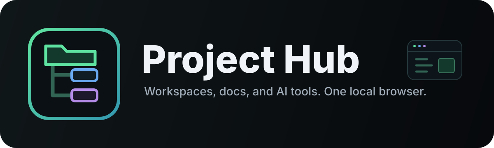
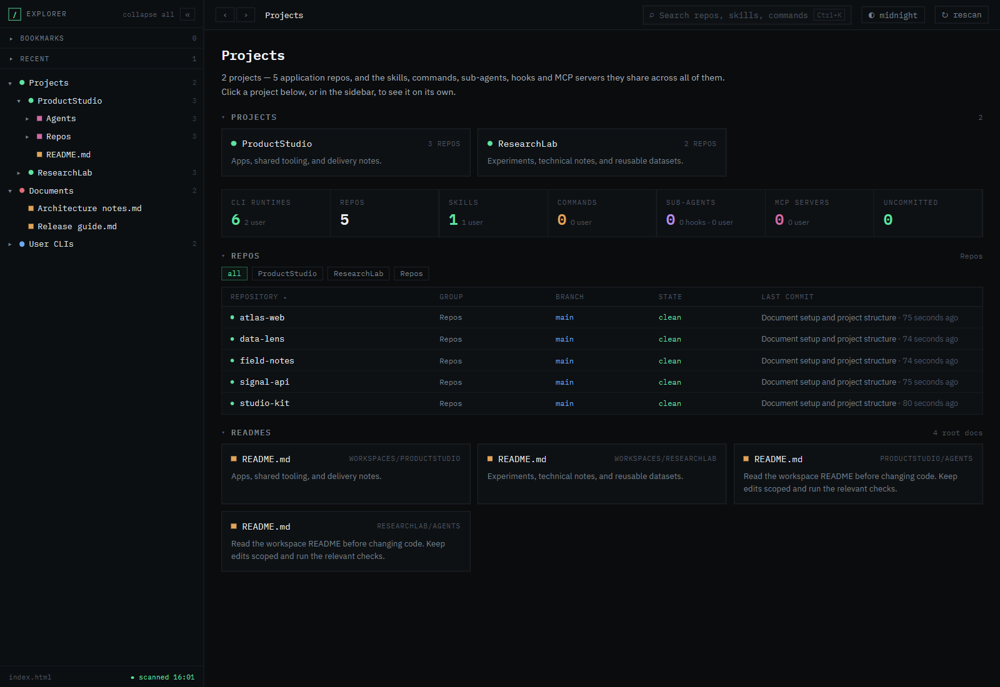
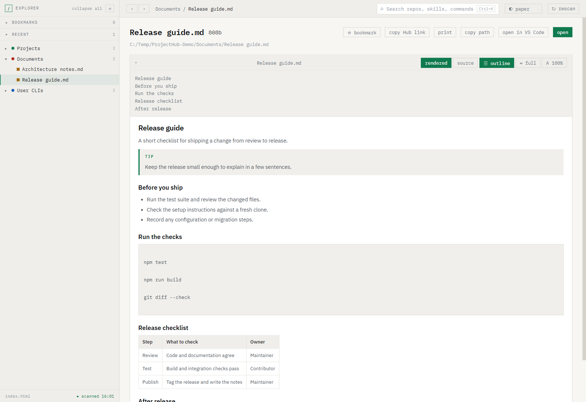

<a id="readme-top"></a>
<a id="html-design-top"></a>

<p align="center">
  <a href="Docs/README.md">
    
  </a>
</p>

<p align="center">
  <em>Your workspaces, docs, and AI tools<br>in one local browser.</em>
</p>

<p align="center">
  <a href="Docs/README.md"><strong>Explore the docs »</strong></a>
</p>

<p align="center">
  <a href="#-screenshots">Screenshots</a> ·
  <a href="#-setup">Quick start</a> ·
  <a href="Skills/project-hub-scaffold-mfs/SKILL.md">Scaffold skill</a>
</p>

<p align="center">
  <a href="Project-Hub/README.md"></a>
  <a href="LICENSE"></a>
  <a href="Docs/ROADMAP.md"></a>
</p>

<p align="center">
  
  
  
</p>

---

**Project Hub** scans your workspaces and displays their repos, Git status, documents,
and AI agent tools in one browser interface. Browse files, search, bookmark pages,
and preview Markdown, PDFs, HTML reports, and images. The view updates as files change.

One local server handles all your workspaces. No build step or runtime dependencies.

## 📸 Screenshots

Sample workspaces with fictional content. Click an image for the full view.

[](Images/Public/project-overview.png)

<details>
<summary><strong>📖 Document reader · paper theme</strong></summary>

[](Images/Public/document-reader.png)

</details>

## 🔧 Setup

Requires Node 18.17+ and Git on PATH. Windows launchers also need PowerShell 7 (`pwsh`).

From the repository root, copy the example configs:

```powershell
Copy-Item Project-Hub/hub.config.example.json Project-Hub/hub.config.json
New-Item -ItemType Directory Projects/My_Workspace
Copy-Item Projects/_example/hub.config.json.example Projects/My_Workspace/hub.config.json
```

Edit the copies before starting:

- **Server config:** set `base` to your workspace base folder and `sharedRoots` to any shared document or picture folders.
- **Workspace config:** set `name` and `dir` for your workspace. Adjust or remove `repoScope` to choose which repos appear.

Real configs stay out of Git. See the [config reference](Hub/README.md#the-config) for details.

## 🚀 Run the hub

From the repository root:

```powershell
./Project-Hub/Start-Hub.ps1
```

Or start Node directly:

```sh
node Hub/hub.mjs --config Project-Hub/hub.config.json
```

Open `http://127.0.0.1:4273`, or the port you configured. Native file-opening actions
are Windows-specific.

To add a workspace, create another `Projects/<Name>/hub.config.json` and restart the
server. Run tests with `npm test` from `Hub/`.

## 📂 Explore the project

| Location | Contents |
|:---|:---|
| [**⚙️ Hub**](Hub/README.md) | Server, scanner, interface, and tests |
| [**🚀 Project-Hub**](Project-Hub/README.md) | Launcher, configuration, and user manual |
| [**📁 Projects**](Projects/_example/hub.config.json.example) | Example workspace config |
| [**📚 Docs**](Docs/README.md) | Guides, roadmap, and design research |
| [**🧩 Scaffold skill**](Skills/project-hub-scaffold-mfs/SKILL.md) | Add workspaces or create a portable installation |
| [**🖼️ Images**](Images/README.md) | Public screenshots and local design references |
| [**🎨 Src**](Src/README.md) | Notes about the original design exports |

To use the scaffold skill, copy its whole folder into your agent's skills directory
and provide the path to this checkout.

## 🔒 Privacy and publishing

The server runs on loopback for local use. Configs, scans, logs, and private design
assets are ignored. Browser fonts and images linked in documents may make external requests.

**Before making this repository public, clean its Git history.** Earlier commits
still contain personal material. See [public release notes](Docs/PUBLIC-RELEASE.md).

---

<p align="center">
  Built with Node.js and vanilla JavaScript · <a href="LICENSE">MIT license</a><br>
  <a href="Project-Hub/README.md">User manual</a> ·
  <a href="Skills/project-hub-scaffold-mfs/SKILL.md">Scaffold skill</a> ·
  <a href="Docs/ROADMAP.md">Roadmap</a>
</p>

<p align="right"><sub><a href="#readme-top">back to top</a></sub></p>
